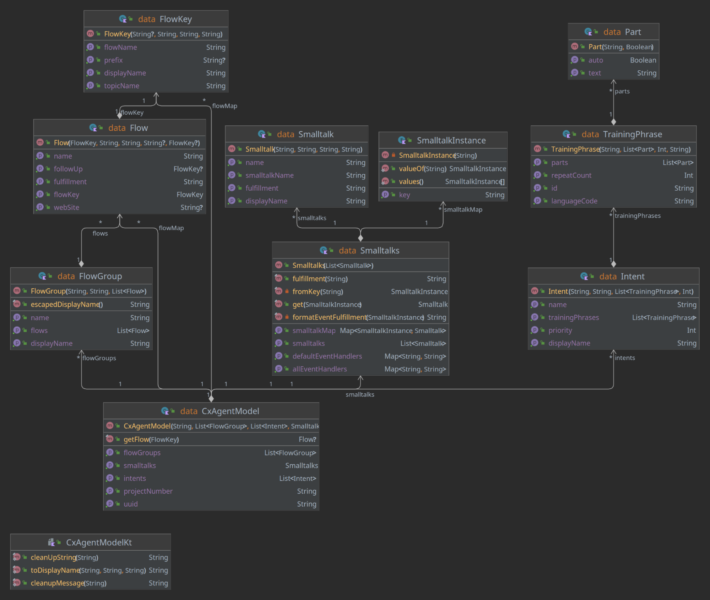
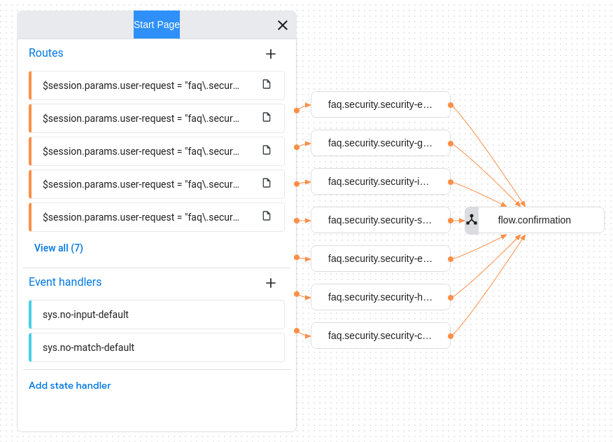
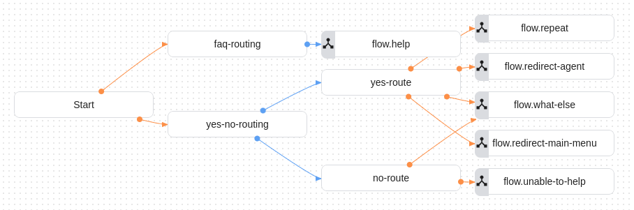
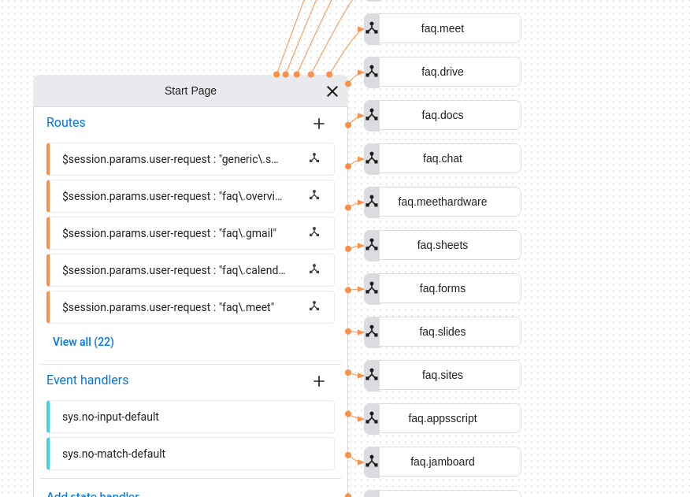
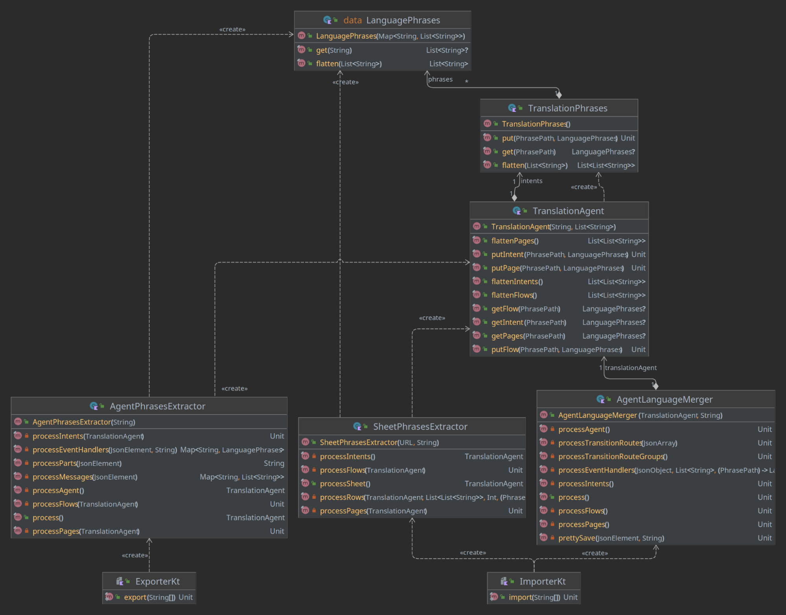

Agent Essentials for CCAI
=========================

### Introduction ###

This document describes two Nuvalence tools that support our CCAI initiative:

* **Agent Generator**: converts a spreadsheet with FAQ-style intents and responses into an Agent ready to be uploaded.
* **Agent Translator**: with two subcomponents:
  * An exporter, which transfers all the Agent’s messages and training phrases to a Google Sheet. 
  * An importer, which combines (modified) messages and training phrases, as well as potentially new translations with the existing Agent, and generates a new Agent ready to be uploaded.

### Common Themes ###

Both Generator and Translator interact with Google Sheets; this interaction is implemented in a shared module with three components:

*   **Authorizer**: pulls the user’s credentials from a given URL, usually pointing to a credentials.json file on disk. Those credentials are used to authenticate and authorize the user against a given Google Sheet. One way to create the credentials.json file is to follow [these steps](https://www.google.com/url?q=https://developers.google.com/workspace/guides/configure-oauth-consent&sa=D&source=editors&ust=1684512764446025&usg=AOvVaw0rqSyfvnQss6oEvwl3eLTZ).
*   **SheetReader**: reads the contents of a spreadsheet range into a list of list of strings.
*   **SheetWriter**: writes a list of list of strings to a new spreadsheet tab.

In addition, both tools convert the spreadsheet they use to an internal representation that is more convenient for the task they need to perform. More details later when we discuss each tool.

### Agent Generator ###

The Generator creates an FAQ-style Agent that follows a design pattern that is easy to extend. The typical utilization is to leverage the Generator to create an initial cut of the Agent, and then use that as a starting point to implement more complex interactions/flows. We describe the structure of the generated Agent later, along with guidance on how to extend it and best practices.

#### Input Spreadsheet Format ####

The Agent expects the input spreadsheet to follow a specific format; it should contain two tabs:

*   A **Smalltalk** tab, with common intents and phrases, such as “yes”, “no”, “website”, etc.
*   A **Questions** tab, with questions broken down by category, training phrases, responses, and optional follow up questions. The Generator only supports English, since there is no point in adding complexity to the Generator when the Translator can handle other languages.

##### Smalltalk Tab #####

This tab has a predefined format:

* An **Intent** column, with the following entries, which **cannot** be modified:

| Intent                                         | Description                                                                                                                                                                                                                               |
|------------------------------------------------|-------------------------------------------------------------------------------------------------------------------------------------------------------------------------------------------------------------------------------------------|
| **Welcome Message**                            | This is what the Agent says the first time a user accessed the system.                                                                                                                                                                    |
| **no-input-default**                           | The default Agent response when the user does not say anything for a period of time.                                                                                                                                                      |
| **no-input-1**, **no-input-2**, **no-input-3** | These override the default above, and provide different prompts when there is no input from the user. This adds more color to the conversation.                                                                                           |
| **no-match-default**                           | The default Agent response when it does not understand what the user said.                                                                                                                                                                |
| **no-match-1**, **no-match-2**, **no-match-3** | Similar to no-input 1, 2 and 3, these provide different prompts when there is no match to what the user said.                                                                                                                             |
| **confirmation**                               | What the Agent asks when it wants to know if the question was answered.                                                                                                                                                                   |
| **unable-to-help**                             | What the Agent says when the user answers “no” to the confirmation question.                                                                                                                                                              |
| **what-else**                                  | What the Agent says when asking the user what else it can help with.                                                                                                                                                                      |
| **how-can-I-help**                             | Pretty straightforward, the question the Agent asks when it wants to know how it can help the user.                                                                                                                                       |
| **help**                                       | Explanation of what kinds of questions the Agent can answer.                                                                                                                                                                              |
| **more-help**                                  | Additional explanation, to add more color to the conversation.                                                                                                                                                                            |
| **website**                                    | The training phrases to request the URL/website associated with the previous question, and the response from the Agent. Note that the URL is in the $session.params.web-site session parameter, so it should be included in the response. |
| **website-missing**                            | What the Agent says when there is no URL/website associated with the last question asked by the user.                                                                                                                                     |
| **repeat**                                     | Training phrases for the repeat intent, i.e. when the user wants the Agent to repeat the answer to the last question.                                                                                                                     |
| **redirect-agent**                             | Training phrases and Agent reply to redirect the user to a human agent.                                                                                                                                                                   |
| **redirect-main-menu**                         | Same, for the main menu.                                                                                                                                                                                                                  |
| **end**                                        | Training phrases and response to end the conversation.                                                                                                                                                                                    |
| **no**                                         | Training phrases for the “no” intent.                                                                                                                                                                                                     |
| **yes**                                        | Training phrases for the “yes” intent.                                                                                                                                                                                                    |

* A **Training Phrases** column, where the training phrases associated with the intents go.
* A **Response** column, with the responses.

Those are used by the Generator to create support flows and intents in addition to the FAQ ones. The Generator looks for entries with the names listed in the Intent column. This will become clear once we discuss the Agent structure, but for now think of them as support snippets that are pieced together by the Generator.

##### Questions Tab #####

This tab also has predefined columns:

*   **Topic**: represents a general category of FAQ, and it is used for grouping purposes. Questions with the same topic are handled by the same Flow in the generated Agent. This helps keep things organized.
*   **Intent**: a unique label for a question within a given topic. Each intent becomes a Page in the generated Agent.
*   **Training Phrases**: a newline separated list of training phrases for the given intent.
*   **Response**: the fulfillment message associated with the intent.
*   **Website**: an optional URL that is passed back to the user when they say “website” or “URL” to the agent.
*   **Follow Up**: answers may have follow up questions similar to “would you like to…”, where a yes/no answer is expected from the user. If the user says “yes”, this column contains the topic and the intent, separated by a newline, that contains the follow up to a yes answer. This column may be blank. You may refer to other entries in the Question page, or entries in the Smalltalk page (for example, smalltalk / redirect-agent).

Those are used by the Generator to create the flows and pages that handle the FAQs.

##### Sample Input Spreadsheet #####

This is a reference input spreadsheet => [Google Workspace FAQs](https://docs.google.com/spreadsheets/d/1TlB8O0ZhQlenJ5T7-WtNu-0rqFhGBEPM4Ld0MOzOQgY/edit?usp=sharing)

### Generation Process ###

#### Spreadsheet Internal Representation ####

The Generator reads the input Spreadsheet and creates an internal structure to support the code generation process. Here is a class diagram showing this structure:

A brief explanation of the major components:

1. **CxAgentModel** holds the model. It has:
   1. FlowGroups, which hold a list of flows for each topic from the Spreadsheet.
   2. Smalltalks, which is a collection of Smalltalk items from the Spreadsheet.
   3. Intents, with the corresponding training phrases.
2. **FlowGroups** have:
   1. A display name that follows a convention: faq.<topic name>
   2. A name, which in Dialogflow parlance is just a UUID.
   3. The list of Flows under that group.
3. **Flows** have:
   1. A key, which abstracts the Flow display name following the standard convention of faq.<topic name>.<intent name> from the spreadsheet.
   2. A name, which is a UUID.
   3. The fulfillment message.
   4. The optional web site and follow up.
4. **Smalltalk** is similar to Flows, but they come from the Smalltalk tab.
5. **Intents** have:
   1. A displayName, following the same naming convention as the Flow.
   2. A name, which is a UUID.
   3. A collection of training phrases.

The SheetParser class reads the input Spreadsheet and creates the model above, which is then used as input by the CxAgentGenerator class.

#### Input Files ####

In addition to the Spreadsheet and corresponding model, there are two types of input files used by the generator:

*   **Static**: those are files that are not affected by the contents of the Spreadsheet, i.e. their contents are static. Those files are kept under the resources/agent directory.
*   **Template**: [Freemarker](https://www.google.com/url?q=https://freemarker.apache.org/&sa=D&source=editors&ust=1684512764456658&usg=AOvVaw2mTtdHK5gr7tGpnrli2bbo) templates, which are used to drive generation of dynamic contents. Those are under the resources/templates directory.

#### Steps ####

The Agent generation is pretty straightforward - it generates a collection of JSON files following the structure described here: [https://cloud.google.com/dialogflow/cx/docs/reference/json-export](https://www.google.com/url?q=https://cloud.google.com/dialogflow/cx/docs/reference/json-export&sa=D&source=editors&ust=1684512764457233&usg=AOvVaw3QpcfwJLNOsweU8MqowbCF)

To accomplish this, given a target directory, we follow the steps below:

*   Create the Agent directory structure: creates the flows and intents directories and subdirectories under the target directory, using data from the internal model.
*   Copy static files: copy all files from resource/agent to the target directory.
*   Generate the agent.json file.
*   Generate all intents: loop through all intents and first generate the <intent name>.json file; then generate the trainingPhrases/en.json file for the intent.
*   Generate the transition route groups: this creates the rg-faq.json file containing the route group for all FAQ intents. This will become clear once we go over the Agent structure.
*   Generate the FAQ flows: for all flows, first, generate the <flow name>.json file under the flows directory; then generate the <page name>.json file under the pages subdirectory.
*   Generate support flows: those are the flows that handle the Smalltalk intents such as “website”, “repeat”, “help”, etc.
*   At this point, all files have been created, and the target directory can be zipped to an agent.zip file.

The agent.zip file can be directly imported into Dialogflow.

### Agent Structure ###

#### Agent Design Goals ####

Besides the ability to handle questions/responses, the generated Agent also can at any time:

*   Recognize “URL” or “website”, and reply with the appropriate URL.
*   Repeat its last response.
*   Understand a request to go back to the main menu.
*   Understand a request to talk to a live agent.
*   Process follow-up questions, where the user is prompted to indicate whether they want additional information.
*   Ability to answer any question, even when expecting yes/no answer from a follow up question.
*   Finally, process no-input and no-match from the user, with different follow up questions and a three-strikes-you-are-out closing of the conversation.

The design also minimizes copy and paste code, while keeping the flows as compact as possible to make them more readable and simplify maintenance.

#### Naming Conventions ####

The generated Agent follows a strict naming convention; please refer to the [Input Spreadsheet Format](#h.6715rqay7wgr) section for the terms used below:

*   FAQ intents are named faq.<topic>.<intent>. For example, faq.ford-pro.vehicle.
*   Smalltalk intents are named generic.smalltalk.<intent>. For example, generic.smaltalk.yes.
*   Each FAQ topic is mapped to a flow named faq.<topic>. For example, faq.ford-pro.
*   Under those flows, each FAQ page is named faq.<topic>.<intent>. For example, faq.ford-pro.vehicle.
*   Support flows are named flow.<flow name>. We will get to those shortly.

#### FAQ Flows ####

FAQ flows have the same structure:

The Start page checks a user-request session parameter and uses it to direct the flow to the appropriate page. The session parameter contents match the page name. For example, faq.ford-pro.software routes to the faq.ford-pro.software page.

Each page has the fulfillment message as defined in the Spreadsheet. In the previous example, that would be “Ford Pro Software provides a connected digital ecosystem that uses live data to integrate vehicles, telematics, charging and servicing into powerful, user-friendly, productivity-boosting platforms. This integrated approach boosts the value of each Ford Pro solution for customers.”

Each page also has a route that either goes to flow.confirmation (when there is no follow up) or to flow.routing (when there is a follow up). We cover flow.routing next.

#### flow.routing ####

As its name suggests, this flow handles all the Agent routing. The reason to consolidate those in a single flow is to avoid duplication of code in the Agent to handle the functionality described in [Agent Design Goals](#h.hw9cud6gcf7c).

Here is the layout of this flow:

There are two types of questions that require routing: 1) FAQ style questions, and 2) follow up questions, which require a yes/no type of answer. The Start page of this flow makes this decision based on a question-type session parameter. This parameter is set to faq-question by the Default Start Flow, and then adjusted accordingly by the different flows. With this content, Start directs control to the faq-routing page. When this parameter has a different content, Start directs the flow to the yes-no-routing page.

We make this distinction because “yes” and “no” are valid answers only in the context of a follow up question, so we need to treat those intents differently depending on each case.

FAQs are processed by a routing group called rg-faq, which is created by the Generator. This routing group has routes for each FAQ intent; a matched intent simply populates the user-request session with the intent name, which also matches the name of the page that will process the intent, and directs the Agent to the appropriate flow group. For example, this routing group has a route for faq.ford-pro.software that sets the user-request parameter to faq.ford-pro.software and directs it to the faq.ford-pro flow. If you recall, the Start page of this flow will then route the Agent to the faq.ford-pro.software page, which has the corresponding fulfillment.

In addition to the rg-faq routing group, another routing group is also generated: rg-smalltalk. This routing group handles the “repeat”, “url”, “agent” etc. intents.

Both routing groups are added to the faq-routing and the yes-no-routing pages, so they are able to uniformly process questions and smalltalks at any point.

“Yes” and “no” intents are handled differently by those two flows. When the user says “yes”, but the agent did not ask a yes/no type of question, faq-routing passes control to flow.help, which explains what the available options are to the user.

In the context of yes-no-routing, yes and no are valid answers - this page figures out which intent was matched, and handles control to yes-route or no-route, which then processes the response based on the question-type parameter. There are a few use cases:

| question-type                                                                            | yes                                                                   | no                  |
|------------------------------------------------------------------------------------------|-----------------------------------------------------------------------|---------------------|
| confirmation  - when we ask “Did this answer your question?”                             | flow.what-else, which asks the user what else the Agent can help with | flow.unable-to-help |
| follow-up - when we prompt the user whether they want additional information             | Described below in flow.repeat                                        | flow.what-else      |
| redirect-agent - when we ask the user if they want to be transferred to an agent         | flow.redirect-agent                                                   | flow.what-else      |
| redirect-main-menu - when we ask the user if they want to be redirected to the main menu | flow.redirect-main-menu                                               | flow.what-else      |

Finally, the Start page of this flow also processes no-match and no-input events. We follow a three-strikes-you-are-out rule, where we say different things to the user, and give up after the third attempt. Those are defined in the Smalltalk tab of the input Spreadsheet.

#### flow.repeat ####

One of the capabilities of the generated Agent is the ability to repeat its last response at any time. Recall that we have the last matched intent stored in the user-request session parameter, along with the corresponding URL in the web-site session parameter. All that flow.repeat needs to do is to figure out which flow handles the current user-request and pass control to it. Given our naming convention, this is easily done:

*   The user-request parameter looks like faq.<intent>.<page>
*   The flow that handles this request is faq.<intent>

Therefore, all we need to do is a “starts with” type of match to find out the flow name. The Generator creates a Start page for this flow with routes that simply direct the Agent to the appropriate flow based on the user-request parameter:

For follow up questions, we leverage flow.repeat: instead of directing the Agent to flow.confirmation, we set two session parameters:

*   user-request-fwd
*   web-site-fwd

With the user request and web site matching the intent that has the answer to the follow up question, and question-type to follow up, handing control back to flow.routing. If the user answers yes to the follow up question, that route copies user-request-fwd to user request, and web-site-fwd to web-site, and then passes control to flow.repeat.

#### Other Flows ####

Several other flows are also created by the Generator to support the design goals listed above. They all start with the “flow” prefix. Since they are all very straightforward, we will not document them here.

#### Extending/Modifying the Agent ####

The generated Agent loosely follows the Single Responsibility Principle: a flow is responsible for one and only one thing. This is true for FAQ and other control flows. When modifying or extending the generated Agent, we recommend adhering to this principle, as well as a well defined naming convention.

There is one downside to applying the Single Responsibility Principle to Dialogflow - at the time of this writing, it has a hard limit on the maximum number of Flows: 50.

There are a couple of ways to work around this limit. The first and obvious one is to reduce the number of FAQ topics: where it makes sense, consolidate closely related topics.

The second one is to consolidate the smaller control flows into one. Except for flow.routing and flow.repeat, the other control flows are very small, and they can be consolidated following a pattern similar to leveraging a session parameter like user-request: create a control-request parameter and consolidate the other eight control flows into one, using the contents of control-request to route to the appropriate page in this consolidated flow.

Another recommendation is to leverage routing groups whenever they show up in different places, particularly in flow.routing. This helps keep the complexity of the flow under control.

Finally, flow.routing handles the no-input and no-match event in its Start page, so that behavior is common across all its pages. However, there are occasions when we want those events to have different messages depending on whether we are processing an FAQ or a yes/no type of question: this being the case, we have to resort to having those handlers defined in both faq-routing and yes-no-routing pages to reflect the different behavior, and removed from the Start page.

### Translator ###

Once an agent has been created, modified and tested using English, it is very likely that we may need to add support for other languages. In addition, URLs and phone numbers require additional prosody, so they can be clearly pronounced in a way that is understandable by the caller.

The Translator is a two step process:

1.  Export the Agent’s phrases to a Google Sheet, so they can be modified, or a new language added.
2.  Import the modified Google Sheet:
   1.  Replacing the Agent’s phrases.
   2.  Creating the corresponding Output Audio Text for each language.
   3.  Adding proper SSML tags to URLs and numbers as part of the process.
   4.  Creating web-site-ssml and web-site-fwd-ssml session parameters that contain URL prosody, so they are used when creating the Output Audio Text.

Note that the Translator assumes that the Agent structure has not changed between Export and Import. In other words, you cannot add a new intent, or add or remove pages, or anything that changes the Agent’s organization. The reason behind this limitation is that the Import process merges the Google Sheet with the existing Agent, so each entry in the spreadsheet must have a match in the Agent. As long as no rows are added or deleted, or any of the title columns are modified (more on this later), the process works. You can, however, add or remove training phrases for existing intents.

#### Google Sheet Structure ####

The export process creates three tabs on a given Google Sheet:

1.  Training Phrases: contains the intents and their training phrases.
2.  Transitions: messages associated with transitions.
3.  Fulfillments: messages associated with page fulfilments.

Let’s look at them in detail. For reference, this is a link to an exported agent: [Export Test](https://www.google.com/url?q=https://docs.google.com/spreadsheets/d/16xjZ4tnVlRLlwd0jiKX6Q7d3TV08jtGWF_SxoCS-DHc/edit%23gid%3D489605739&sa=D&source=editors&ust=1684512764472988&usg=AOvVaw3GuIRsVkU3c-xdN9GQXmOd)

##### Training Phrases #####

This tab contains:

*   An **Intent Name** column, with the different intent names.
*   A column for each language:

*   The top cell contains the language code (e.g. en or es) for that column.
*   The remaining cells contain the training phrases for a given intent/language, one per line.

##### Transitions #####

This tab contains:

*   A **Flow Name** column, with the name of the flow to where the transition belongs.
*   A **Transition Type** column, identifying the type of transition. For example, event when the transition is associated with an **event** like sys.no-input-default.
*   An **Event Name** column, with the name of the event, such as sys.no-input-default.
*   One column per language, as previously described, with the fulfillment message.

##### Fulfillments #####

This tab contains:

*   A **Flow Name** column, identifying the flow.
*   A **Page Name** column, with the name of the page within the flow.
*   A **Type** column, identifying the type of fulfillment. For example, “message” for page fulfillments, or the name of an event.
*   One column per language, as previously described, with the fulfillment message.

##### Motivation #####

The structure just described:

*   Separates the different types of phrases in the Agent based on their utilization.
*   Has columns with enough information to match the location where the phrase came from and should go - think of the first columns as the address of the message within the Agent, expressed in a way that is understandable by humans (instead of using, for example, UUIDs).

#### Adding New Languages ####

Just add a new column to each of the tabs above, where the topmost cell contains the language code, and the other cells the appropriate translations. The Import process will add the new language to the Agent.

#### Code Structure ####

Here is a class diagram with the relevant classes:

A brief explanation of the main components:

1.  **TranslationAgent** contains an internal representation of the phrases associated with the Agent, as well as a few helper methods to manipulate them.
2.  **TranslationPhrases** holds the actual phrases and their paths inside the Agent.
3.  **LanguagePhrases** holds the actual phrases for a given language.
4.  **AgentPhrasesExtractor** extracts the phrases from an exploded agent.zip export and creates an instance of the **TranslationAgent**. It is used by the **Exporter** process, which creates the Google Sheet tabs.
5.  **SheetPhrasesExtractor** extracts the phrases from the Google Sheet tabs and creates an instance of the **TranslationAgent**.
6.  **AgentLanguageMerger** merges the **TranslationAgent** imported from the Google Sheet into the existing Agent. It is used by the Importer process.
7.  Not shown in the diagram for clarity reasons are the **PhraseType** enum, encapsulating the different types of phrases, and the **PhrasePath** class, encapsulating the path to a phrase within the Agent.

#### Export Process ####

The export process uses an instance of the AgentPhraseExtractor to traverse the Agent directory structure,  parsing all its JSON files, extracting the phrases and their paths, and creating an instance of the TranslationAgent. This instance is then used to create the different tabs in the target Google Sheet.

The process is pretty straightforward - navigate the Agent subdirectories processing the intents, flows and pages. The path to each message is a combination of the path to the file being processed (flow name, page name, etc.) and the location within the target object being processed.

Once the TranslationAgent instance is created, the exporter uses it to create the three tabs as described above. Note how the TranslationAgent organizes the information matching the three tabs of the exported Sheet.

#### Import Process ####

The import process is a bit more complicated. First, it reads the source Google Sheet to create an instance of the TranslationAgent. Then it navigates the Agent subdirectories processing intents, flows and pages; in the process it merges the TransationAgent contents into the internal representation of each of those files, replacing existing phrases with the ones from the TranslationAgent, and adding a new language if applicable. It then overwrites the file with the new, updated content. The path information is used to associate the information from the TranslationAgent to the element currently being processed.

In addition:

1.  It generates and adds Output Audio Text for each language, with the appropriate SSML tags.
2.  It looks for instances where URLs are assigned to the web-site and web-site-fwd parameters, and creates matching web-site-ssml and web-site-fwd-ssml variables with SSML tags. Those are used in the Output Audio Text instances instead of the original web-site and web-site-fwd references, so we get an adequate prosody.

##### URL Prosody #####

Proper URL enunciation requires:

1.  A slower prosody rate (80%).
2.  A break of 300ms before saying the URL.
3.  A break of 100ms before saying the “.” or the “/”.
4.  Some heuristics related to spelling or saying the URL as is:

1.  URL components with three characters or shorter are spelled out, unless they are part of a white list including “com”, “gov”, etc.
2.  Longer components are checked against a regular expression that detects sequences of consonants that cannot be properly pronounced in English (e.g. qq or hh). If there is a match, the URL is spelled out; otherwise, read as is.
3.  This regular expression may need to be revisited based on future use cases.

##### Number Prosody #####

Proper number enunciation requires:

1.  A slower prosody rate (80%).
2.  A break of 300ms before saying the number.
3.  Separating the number into its individual digits, so 0 is pronounced as “zero” instead of “oh”.
4.  Except for:
   1.  800, which is pronounced “eight hundred”.
   2.  Time, which is not changed (e.g. 5:25pm is pronounced five twenty five p m, not 5 2 5 pm).

##### Language Specific Prosody #####

For URLs and numbers, the rules described above seem satisfactory enough for English and Spanish. It is possible, however, that other languages may require something different. This being the case, the Importer should have a different set of rules for each language.

The  complicating factor is the web-site and web-site-fwd session parameters - for this particular case, instead of generating single web-site-ssml and web-site-fwd-ssml common to all languages, we should instead generate language specific ones (e.g. web-site-ssml-pt-br), and use those when creating the language specific Output Audio Text

### Future Work ###

A few nice to have improvements:

1.  Make the generator and the export/import process accessible via URL/browser, so they become readily accessible tools.
2.  As part of the process, expose the URL and Number heuristic parameters, so they can be easily adapted for different clients.
